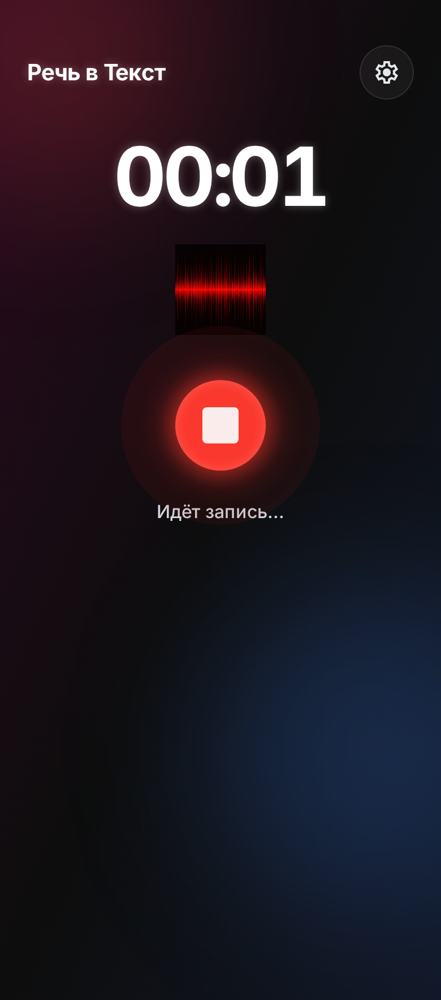
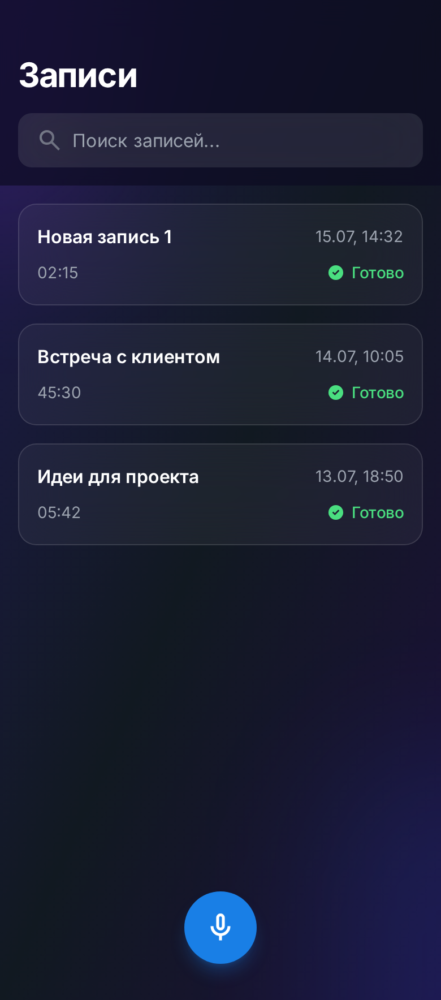
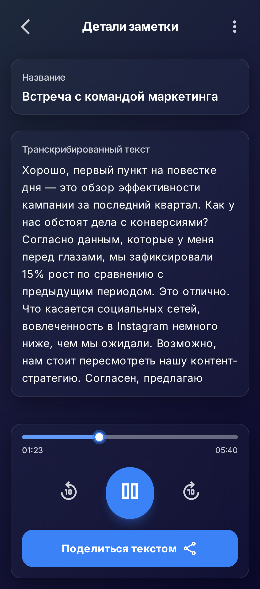
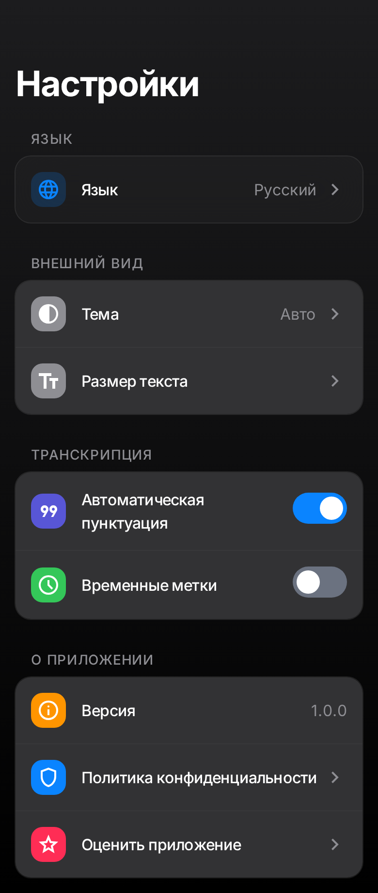

# Recorder

**[English](#english)** | **[Русский](#русский)**

---

<a id="english"></a>

## 🎙 Recorder — Voice Notes with Transcription

An iOS app for recording voice notes with speech-to-text transcription powered by [WhisperKit](https://github.com/argmaxinc/WhisperKit).

### Screenshots

<p align="center">
  
  
  
  
</p>

### Features

- Audio recording with real-time waveform visualization
- Speech-to-text transcription (WhisperKit, `whisper-base` / `whisper-small` models)
- Two transcription modes: fast and accurate
- Notes list with search, editing, and deletion
- Import audio files for transcription
- Auto-deletion of old recordings (7 / 14 / 30 / 60 / 90 days)
- Auto-backup and audio archiving
- Localization: Russian and English
- Dark / light / system theme
- Data storage with Core Data

### Requirements

- iOS 17.0+
- Xcode 16+
- Swift 5.9+

### Project Structure

```
Recorder/
├── CoreData/        — Core Data model and extensions
├── Models/          — Data models (AudioNote, TranscriptionMode, etc.)
├── Services/        — Services (recording, playback, storage, transcription)
├── Transcription/   — Transcription engine (WhisperKit)
├── Utilities/       — Utilities (settings, formatters, logger, monitoring)
├── ViewModels/      — View models (Recording, NotesList, NoteDetail, Settings)
├── Views/           — SwiftUI screens
└── Resources/       — Localization (Localizable.xcstrings)
```

### Architecture

The app follows the MVVM (Model-View-ViewModel) pattern with a service layer. Dependency injection is handled through a `ServiceContainer` singleton. Key services include `AudioRecorderService`, `TranscriptionService`, `NotesStorageService`, and `FileStorageService`.

### Build & Run

1. Open `Recorder.xcodeproj` in Xcode.
2. Select a target device or simulator.
3. Press `Cmd + R`.

### License

All rights reserved.

---

<a id="русский"></a>

## 🎙 Recorder — Голосовые заметки с транскрипцией

iOS-приложение для записи голосовых заметок с транскрипцией речи в текст на базе [WhisperKit](https://github.com/argmaxinc/WhisperKit).

### Скриншоты

<p align="center">
  
  
  
  
</p>

### Возможности

- Запись аудио с визуализацией волновой формы в реальном времени
- Транскрипция речи в текст (WhisperKit, модели `whisper-base` / `whisper-small`)
- Два режима транскрипции: быстрый и точный
- Список заметок с поиском, редактированием и удалением
- Импорт аудиофайлов для транскрипции
- Автоудаление старых записей (7 / 14 / 30 / 60 / 90 дней)
- Автобэкап и архивирование аудио
- Локализация: русский и английский
- Тёмная / светлая / системная тема оформления
- Хранение данных в Core Data

### Требования

- iOS 17.0+
- Xcode 16+
- Swift 5.9+

### Структура проекта

```
Recorder/
├── CoreData/        — Core Data модель и расширения
├── Models/          — Модели данных (AudioNote, TranscriptionMode и др.)
├── Services/        — Сервисы (запись, воспроизведение, хранение, транскрипция)
├── Transcription/   — Движок транскрипции (WhisperKit)
├── Utilities/       — Утилиты (настройки, форматтеры, логгер, мониторинг)
├── ViewModels/      — View-модели (Recording, NotesList, NoteDetail, Settings)
├── Views/           — SwiftUI-экраны
└── Resources/       — Локализация (Localizable.xcstrings)
```

### Архитектура

Приложение построено по паттерну MVVM (Model-View-ViewModel) с сервисным слоем. Внедрение зависимостей реализовано через синглтон `ServiceContainer`. Ключевые сервисы: `AudioRecorderService`, `TranscriptionService`, `NotesStorageService` и `FileStorageService`.

### Сборка

1. Откройте `Recorder.xcodeproj` в Xcode.
2. Выберите целевое устройство или симулятор.
3. Нажмите `Cmd + R`.

### Лицензия

Все права защищены.
