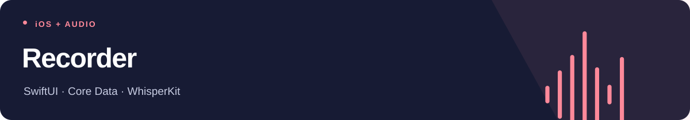
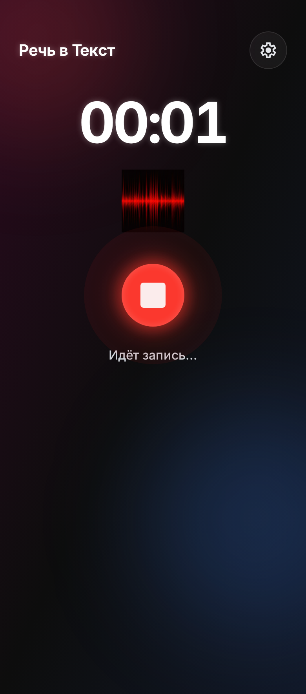
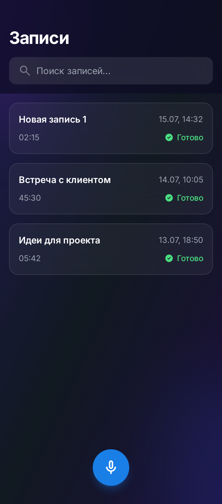
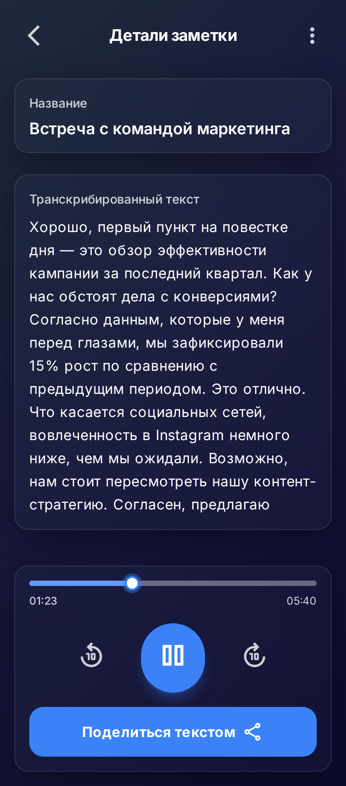
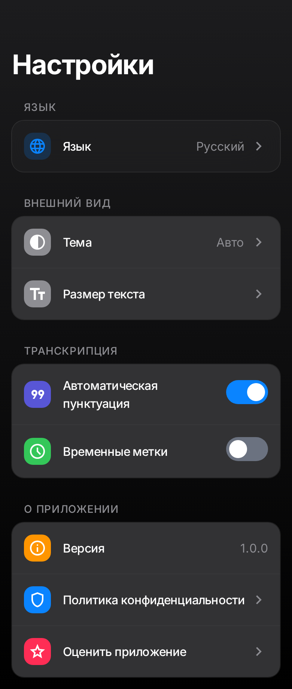

<p align="center">
  
</p>

# Recorder

**Запишите мысль. Найдите её в тексте.**

iOS-приложение для голосовых заметок: запись аудио, локальная транскрипция через [WhisperKit](https://github.com/argmaxinc/WhisperKit), поиск и редактирование заметок.

[Запуск](#запуск) · [Архитектура](#архитектура) · [Поддержка](Support.md) · [Конфиденциальность](PrivacyPolicy.md) · [English](#english)

## Дизайн интерфейса

Макеты экранов из каталога [Дизайн](Дизайн): запись, список заметок, отдельная заметка и настройки.

<p align="center">
  
  
  
  
</p>

## Возможности

- **Запись и воспроизведение** с визуализацией волновой формы.
- **Речь в текст** через WhisperKit: быстрый режим `openai_whisper-base` и точный `openai_whisper-small`.
- **Заметки** с поиском по названию и транскрипции, редактированием и удалением.
- **Импорт аудио:** M4A, MP3, WAV, AAC и CAF.
- **Локальное хранение:** заметки в Core Data, аудиофайлы в каталоге приложения.
- **Оформление:** русский и английский языки; светлая, тёмная и системная темы.

В настройках также предусмотрены интервалы удаления старых записей — 7, 14, 30, 60 и 90 дней — и переключатели архивирования и автобэкапа. Эти настройки требуют отдельной проверки поведения: наличие переключателя само по себе не подтверждает выполнение резервного копирования.

## Запуск

Нужны macOS, Xcode и устройство или симулятор с **iOS 17.0+**. Проект сохранён в Xcode **26.1**, язык проекта — Swift 5.

```bash
git clone https://github.com/artemleonich/Recorder.git
cd Recorder
open Recorder.xcodeproj
```

1. Дождитесь разрешения зависимости WhisperKit через Swift Package Manager.
2. Выберите схему `Recorder` и устройство или симулятор.
3. Для физического устройства укажите свою команду в **Signing & Capabilities**; при необходимости смените Bundle Identifier.
4. Нажмите `Cmd + R` и разрешите доступ к микрофону для записи.

Подготовка моделей WhisperKit при первом использовании может требовать интернета. Транскрипция выполняется на устройстве; её скорость зависит от устройства и выбранной модели.

## Архитектура

Swift · SwiftUI · Core Data · AVFoundation · Combine · WhisperKit.

Приложение использует **MVVM** и сервисный слой. `ServiceContainer` связывает запись, хранение и транскрипцию; `WhisperTranscriptionEngine` реализует асинхронный движок распознавания.

| Каталог | Назначение |
| --- | --- |
| [Recorder/CoreData](Recorder/CoreData) | Модель Core Data и преобразования сущностей |
| [Recorder/Models](Recorder/Models) | Заметки, режимы и результаты транскрипции |
| [Recorder/Services](Recorder/Services) | Запись, воспроизведение, файлы и заметки |
| [Recorder/Transcription](Recorder/Transcription) | Интерфейс движка и реализация WhisperKit |
| [Recorder/ViewModels](Recorder/ViewModels) | Логика экранов |
| [Recorder/Views](Recorder/Views) | SwiftUI-интерфейс |
| [Recorder/Utilities](Recorder/Utilities) | Настройки, форматирование и диагностика |
| [Recorder/Resources](Recorder/Resources) | Локализация |
| [RecorderTests](RecorderTests) | Исходники проверок сервисов, интеграции и интерфейса |

Каталог `RecorderTests` есть в репозитории; для запуска проверок его необходимо подключить к тестовой цели Xcode — текущий файл проекта содержит только цель приложения.

## Поддержка и конфиденциальность

Инструкции для пользователей — в [Support.md](Support.md). Обработка данных описана в [PrivacyPolicy.md](PrivacyPolicy.md).

## English

Recorder is an iOS voice-notes app built with SwiftUI, Core Data, and WhisperKit. It supports recording and playback, on-device transcription in fast and accurate modes, audio import, note search and editing, Russian / English localization, and light / dark / system appearance.

Open `Recorder.xcodeproj`, resolve Swift packages, choose the `Recorder` scheme, configure signing for a physical device, and press `Cmd + R`. The deployment target is iOS 17.0; the project was saved with Xcode 26.1. Model preparation may need internet access.

The images above are design mockups. Backup-related settings and the test sources require further integration or verification.

## Права / Rights

Все права защищены. / All rights reserved.

